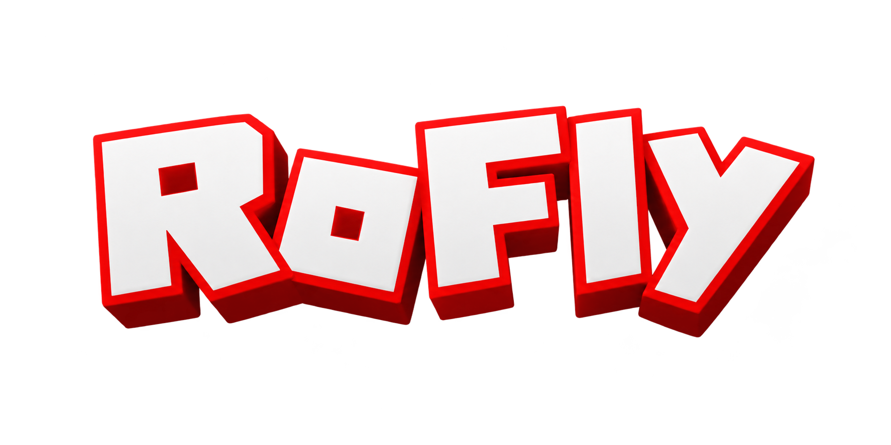

# RoFLy 3.1

<p align="center">  </p>

An experimental autonomous agent for the Roblox platform, powered by a full-graph simulation of the **MaleCNS v1.0** *Drosophila* connectome. RoFLy ingests live screen data, processes it through a biologically-structured neural graph, and emits continuous behavioral outputs — no hardcoded macros or heuristic rules.

---

## How It Works

RoFLy runs a continuous four-stage loop:

**1. Perception** — Polls the active Roblox client window. A vision module extracts spatial object proximities; a parallel OCR thread reads chat logs, system prompts, and UI text.

**2. Connectome Controller** — Maps sensory inputs onto entry-points in the MaleCNS v1.0 biological graph. Signals propagate across millions of synaptic connections without aggressive circuit clipping.

**3. Latent Decoder** (`roblox_decoder.npz`) — Intercepts descending neural firing patterns at the network boundary and translates them into keystroke durations and navigation inputs. The included weights were trained on **800 behavioral samples**, giving the connectome a learned basis for movement rather than hardcoded rules. At this sample count, movement accuracy sits at roughly **35–50%**. The sample count is configurable — more samples improve accuracy, fewer reduce training time.

**4. Social State & Persistence** — Neural baselines and memory thresholds persist across character resets, allowing the agent to maintain contextual awareness and respond organically in game chat.

---

## Requirements

- Python 3.11
- A local C++ compilation toolchain (required for the native execution kernel)
- A standalone Roblox client installed separately
- ~1.3 GB free disk space (for graph topology files pulled via Git LFS)

---

## Setup

### 1. Install dependencies

```bash
python3.11 -m venv .venv
source .venv/bin/activate
pip install --upgrade pip
pip install -r requirements.txt
```

### 2. Pull large data files

```bash
git lfs pull
python -m doom.audit_data
```

This verifies that `edges.feather` and `edges.arrow` downloaded correctly.

---

## Running

1. Open Roblox and join your target experience. Keep the window visible on screen.

2. Start the biological backend (resolves synapse dynamics):
   ```bash
   python -u -m doom.server --model experimental-v6 --port 8766
   ```

3. In a second terminal, start the main orchestration script:
   ```bash
   python run_roblox_social.py
   ```

4. When prompted, click on the Roblox window to transfer input focus to the game.

> **Note:** `roblox_decoder.npz` ships with weights pre-trained on 800 samples (~35–50% movement accuracy). This is sufficient to get started. To improve accuracy, you can retrain the decoder with a higher sample count; to speed up training, reduce it.

---

## Project Structure

```
.
├── doom/
│   ├── server.py          # Biological backend / synapse resolver
│   └── audit_data.py      # Data integrity checks
├── run_roblox_social.py   # Main orchestration entry point
├── roblox_decoder.npz     # Pre-trained latent movement decoder weights
├── edges.feather          # Connectome graph topology (Git LFS)
├── edges.arrow            # Connectome graph topology (Git LFS)
├── requirements.txt
├── LICENSE
└── THIRD_PARTY_NOTICES.md
```

---

## Disclaimers

- **Affiliation:** RoFLy 3.1 is an independent research project, unaffiliated with Roblox Corporation, id Software, Bethesda, or the scientific consortiums behind the MaleCNS dataset.
- **Scientific scope:** The graph topology faithfully replicates structural biological connectivity matrices. Input mappings and game interactions are engineering designs; passing unit tests validates framework stability, not biological replication.
- **Terms of service:** Use of automated agents may violate the terms of service of the target platform. Use responsibly and at your own risk.

---

## License

The orchestration architecture, input wrappers, and integration modules are licensed under the **MIT License**. Underlying network datasets and third-party components retain their parent licenses — including **Creative Commons Attribution 4.0 International** for the MaleCNS v1.0 records. See `LICENSE` and `THIRD_PARTY_NOTICES.md` for details.
